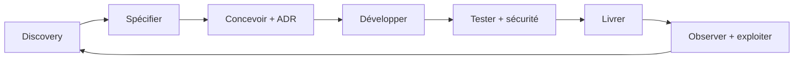

# Corpus de spécifications — Open Purchase Cockpit

Ce dossier constitue la référence produit et technique du projet. En cas de divergence, les décisions consignées dans les ADR priment sur les exemples.

## Livrables

| Document | Contenu |
|---|---|
| [initial-prompt.md](initial-prompt.md) | Archive du prompt initial ayant fondé les spécifications |
| [product-specification.md](product-specification.md) | Vision, personas, processus, fonctions et UX |
| [architecture.md](architecture.md) | Options d'architecture, recommandation et modèle de données |
| [sap-integration.md](sap-integration.md) | Mapping SAP, Clean Core et stratégie connecteurs |
| [api.md](api.md) | Conventions et catalogue de l'API interne |
| [openapi.yaml](openapi.yaml) | Contrat OpenAPI exécutable du MVP |
| [security.md](security.md) | Menaces, IAM, RBAC, périmètres et audit |
| [ai-and-rules.md](ai-and-rules.md) | Moteur de règles et agents IA optionnels |
| [user-stories.md](user-stories.md) | Backlog initial et critères Gherkin |
| [quality-and-testing.md](quality-and-testing.md) | NFR, stratégie de tests et Definition of Done |
| [roadmap.md](roadmap.md) | MVP, versions, jalons et critères de sortie |
| [repository-structure.md](repository-structure.md) | Structure GitHub, licence et gouvernance |
| [data/demo-dataset.md](data/demo-dataset.md) | Contrat et couverture des données fictives |

## Gouvernance des exigences

- Identifiants `FR-xxx` : exigences fonctionnelles.
- Identifiants `NFR-xxx` : exigences non fonctionnelles mesurables.
- Identifiants `US-xxx` : user stories.
- Identifiants `ADR-xxx` : décisions d'architecture.
- Toute évolution fonctionnelle met à jour l'exigence, le contrat API et au moins un test.
- Les champs, API et CDS SAP exacts sont qualifiés par connecteur et validés sur le système cible avant réalisation.

## Cycle SDLC

Les quality gates, responsabilités et preuves attendues sont détaillés dans `quality-and-testing.md`.
