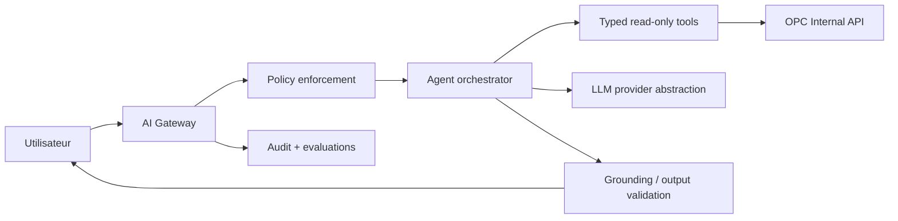

# Alertes, règles et intelligence artificielle

## 1. Moteur de règles

Les alertes déterministes précèdent l'IA. Une règle est un document YAML/JSON versionné : `id`, `version`, `description`, `entityType`, `when` (AST d'opérateurs allowlist), `severity`, `dedupKey`, `evidenceFields`, `effectiveFrom/To`, `ownerPolicy`, `resolutionCondition`. Aucun code arbitraire, accès réseau ou secret.

Cycle : `DRAFT → VALIDATED → APPROVED → ACTIVE → RETIRED`. Publication à quatre yeux, simulation sur données historiques, métriques de volume/faux positifs et rollback immédiat. Les paramètres (jours, tolérance prix/quantité, calendriers) sont externalisés par société/organisation/catégorie.

```yaml
id: late-delivery
version: 1.0.0
entityType: PurchaseOrderItem
when:
  all:
    - {field: effectiveDeliveryDate, op: beforeBusinessDate, value: TODAY}
    - {field: remainingQuantity, op: greaterThan, value: 0}
    - {field: deletionFlag, op: equals, value: false}
then:
  type: LateDeliveryAlert
  severity: HIGH
  dedupKey: [sourceSystem, purchaseOrderId, itemNo, scheduleLine]
  evidenceFields: [effectiveDeliveryDate, orderedQuantity, receivedQuantity]
resolutionCondition: remainingQuantity <= 0
```

Règles initiales :

- `LateDeliveryAlert`: date effective < date métier ET reçu < commandé.
- `PriceMismatchAlert`: écart prix absolu ou relatif > tolérance active, après normalisation unité/devise.
- `QuantityMismatchAlert`: quantité facturée > quantité reçue + tolérance.
- `DeliveryRiskAlert`: échéance dans ≤3 jours ouvrés ET confirmation requise absente.
- `MissingReceiptAlert`: échéance passée et aucun GR net non annulé.
- `MissingInvoiceAlert`: réception complète depuis N jours et aucune facture non annulée.

Chaque alerte stocke valeur observée, seuil, source, timestamp, version de règle et lien vers entité. Une nouvelle évaluation met à jour la même dédup-key; elle ne duplique pas. La condition de résolution ferme automatiquement et journalise la preuve.

## 2. Agents IA optionnels

| Agent | Entrées | Outils/API en allowlist | Règles / sortie | Actions et validation humaine |
|---|---|---|---|---|
| Purchase Monitoring | PO ouvertes, échéances, alertes | API PO/deliveries/alerts read | résumé priorisé, causes et références | suggère assignation/relance; humain confirme toute mutation/contact |
| Late Delivery | échéanciers, confirmations, GR, calendrier, historique | deliveries, supplier performance | probabilité calibrée + facteurs, jamais statut SAP | crée seulement une suggestion; publication alerte selon règle approuvée ou humain |
| Supplier Risk | OTIF, incidents, concentration, prix | supplier performance/spend | signaux sourcés, limites et période | pas de blocage/déréférencement; revue responsable fournisseur |
| Invoice Matching | PO, GR, facture, tolérances | invoice/PO/GR read | explication 3-way match poste par poste | aucune libération/blocage SAP; contrôleur décide |
| Spend Analysis | agrégats autorisés, taux, dimensions | spend API | tendances, ruptures, méthode | export ou analyse après confirmation; pas d'accès au détail hors scope |
| Procurement Copilot | question, contexte UI, identité/scope | recherche structurée via API internes | réponse FR/EN, sources, filtres, fraîcheur, incertitude | lecture seule MVP; toute action matérialisée exige écran de confirmation |

## 3. Architecture IA



Le modèle n'émet ni SQL, ni OData, ni URL libre. Les questions sont traduites en appels d'outils typés, toujours sous identité utilisateur. Les réponses citent documents/agrégats OPC, fraîcheur et filtres; en absence de preuve, l'agent dit qu'il ne sait pas. Les données envoyées à un fournisseur de modèle sont minimisées et régies par contrat/région/rétention.

## 4. Évaluation et garde-fous

- Jeu de référence couvrant questions exemples, scopes antagonistes, prompt injections et ambiguïtés.
- Mesures : exactitude factuelle ≥95 % sur gold set MVP IA, citations valides ≥99 %, fuite cross-scope = 0, taux d'abstention suivi, latence p95 cible ≤10 s.
- Red teaming avant activation, feature flag/kill switch, budget/coût et rate limit.
- Les prédictions de risque affichent version, date d'entraînement/évaluation, facteurs et métriques par segment; pas d'attribut protégé.
- Prompts, tool calls et décisions sont auditables avec redaction; consentement/notice si requis.
