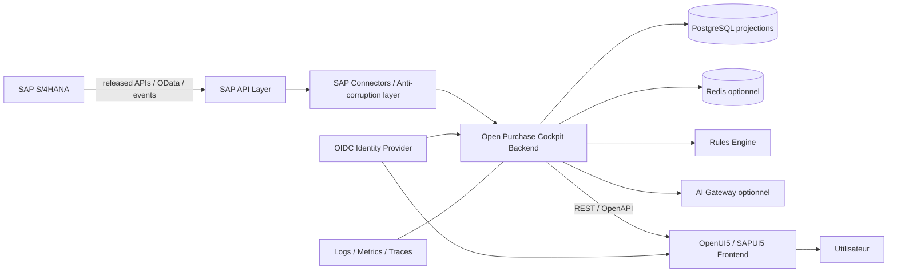
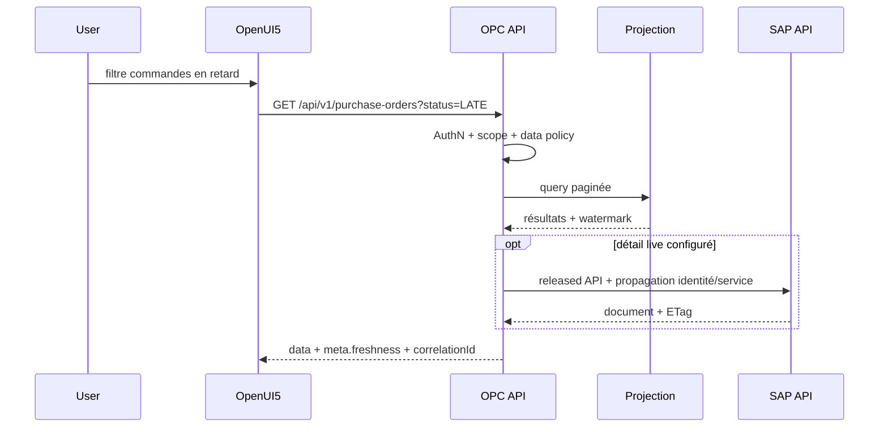
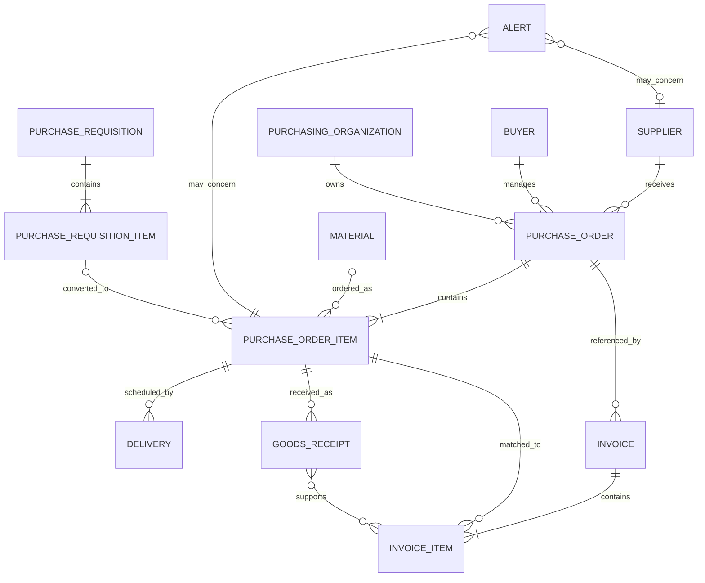

# Architecture de solution

## 1. Options

| Critère | A — SAP native | B — Open Source | C — SAP BTP |
|---|---|---|---|
| Chaîne | S/4 → CDS → OData → UI5/Fiori | S/4 → API/OData → backend OSS → PostgreSQL/cache → OpenUI5 | S/4 → API/CDS → BTP/CAP → UI5/Fiori |
| Complexité | faible à moyenne si compétences ABAP/UI5 | moyenne; connecteurs et exploitation à construire | moyenne; services BTP/CAP à maîtriser |
| Coût | licences/infrastructure SAP existantes | composants gratuits; coût d'hébergement et d'exploitation | consommation/abonnements BTP |
| Performance | excellente proximité SAP, charge directe à maîtriser | bonnes projections/cache; cohérence éventuelle | bonne connectivité BTP, dépend des services |
| Sécurité | IAM SAP intégré | IAM OIDC et réseau à intégrer | IAS/XSUAA/Destination facilitent l'intégration |
| Maintenabilité | forte dépendance release/compétences SAP | forte testabilité; adaptateurs isolent SAP | bonne avec CAP, dépendance plateforme |
| Clean Core | très bon avec CDS/API publiées | très bon si API-first; aucun accès DB direct | excellent avec released APIs/events |
| Déploiement | transport SAP | Docker/Kubernetes/VM, portable | Cloud Foundry/Kyma/BTP |
| Potentiel OSS | limité par runtime et artefacts SAP | maximal | code ouvert, runtime BTP requis |

### Décision ADR-001

**Option recommandée : B — Open Source.** C'est la seule qui maximise portabilité, contribution communautaire et développement sans SAP, tout en restant Clean Core via des adaptateurs API-first.

**Alternative : C — SAP BTP** pour une organisation déjà standardisée sur IAS, Destination, Cloud Connector et CAP. **Alternative : A** pour une extension strictement interne, faible envergure, dont l'open source et la portabilité ne sont pas prioritaires.

## 2. Architecture recommandée

### Composants

- `frontend/` : TypeScript/OpenUI5 recommandé; SAPUI5 possible en contexte licencié. Aucun secret ni appel SAP direct.
- `backend/` : TypeScript LTS avec NestJS ou Fastify recommandé. Java/Spring Boot et Python/FastAPI sont des adaptateurs de mise en œuvre acceptables si le contrat OpenAPI et le domaine restent identiques.
- `domain/` : modèle pur, statuts, KPI, services de rapprochement; aucune dépendance SAP.
- `sap-connectors/` : ports, mappers et connecteurs par édition/release. Pagination, delta, retry borné et circuit breaker.
- `analytics/` : projections datées, conversion de devise, agrégats reproductibles.
- `rules/` : règles déclaratives versionnées, sandboxées et simulables.
- `agents/` : orchestration IA optionnelle, outils en lecture seule par défaut.

### Modes de données

1. **Live** : détail sensible à la fraîcheur lu depuis SAP, avec cache court et `sourceTimestamp`.
2. **Projection** : synchronisation incrémentale pour listes, agrégats et historique; watermark par source.
3. **Mock** : même port fournisseur, données déterministes, erreurs et latence injectables.

PostgreSQL ne remplace pas SAP. Chaque enregistrement projeté contient `sourceSystem`, clé SAP canonique, `sourceLastChangedAt`, `ingestedAt` et, si disponible, ETag. Les suppressions logiques/annulations sont propagées. Un rapprochement périodique détecte dérives et trous de delta.

### Flux d'une requête

## 3. Modèle métier simplifié

| Entité | Attributs principaux |
|---|---|
| PurchaseRequisition | id, itemNo, type, description, materialId, requestedQty, unit, estimatedPrice, currency, requester, plant, purchasingGroup, approvalStatus, requestedDate, poRefs |
| PurchaseOrder | id, type, supplierId, companyCode, purchasingOrgId, purchasingGroup, buyerId, orderDate, currency, netValue, status, source timestamps |
| PurchaseOrderItem | poId, itemNo, materialId, description, plant, category, orderedQty, receivedQty, invoicedQty, unit, netPrice, priceUnit, deliveryDate, confirmationStatus, deletionFlag |
| Supplier | id, name, country, purchasingBlocks, purchasingOrganizations, categories, risk/incident summaries |
| Material | id, description, type, group/category, baseUnit, plants |
| Delivery | id/source key, poItem, scheduledDate, confirmedDate, quantity, receivedQty, status |
| GoodsReceipt | materialDocument, year, item, poItem, postingDate, quantity, unit, amount, currency, movementType, reversalRef |
| Invoice | id, fiscalYear, supplierId, companyCode, invoiceDate, postingDate, grossAmount, currency, blocked, status |
| InvoiceItem | invoiceId, itemNo, poItem, quantity, amount, taxCodeMasked, priceVariance, quantityVariance |
| Buyer | id, displayName, purchasingGroups; identité minimale |
| PurchasingOrganization | id, name, companyCodes, plants |
| Alert | UUID, type, severity, entityRef, ruleId/version, evidence JSON, status, owner, dueAt, timestamps |

Cardinalités particulières : une PR peut être fractionnée vers plusieurs PO; un poste PO peut provenir de plusieurs PR; les historiques contiennent retours et annulations; une facture peut référencer plusieurs PO. Les clés techniques ne doivent jamais supposer qu'un numéro est global sans système source, mandant et exercice lorsque applicable.

## 4. Déploiement

- Conteneurs OCI non-root; frontend statique, API, worker de synchronisation, mock SAP, PostgreSQL; Redis facultatif.
- En production : PostgreSQL managé, sauvegarde chiffrée, ingress TLS, egress SAP explicitement autorisé, secrets externes.
- En local : Docker Compose avec données synthétiques et IdP de développement; aucun artefact SAP propriétaire distribué.
- Migrations forward-only, compatibles rolling deployment; API versionnée `/api/v1`.

## 5. Décisions restant à valider

- Édition/release S/4HANA et APIs publiées disponibles.
- Source des confirmations fournisseurs et des catégories achats.
- Sémantique services/limites/consignation, tolérances 3-way match et calendrier métier.
- IdP, modèle de propagation d'identité, devise de groupe et fréquence de synchronisation.
- Licence UI5 retenue : OpenUI5 pour la distribution ouverte; composants SAPUI5 uniquement sous droits appropriés.
