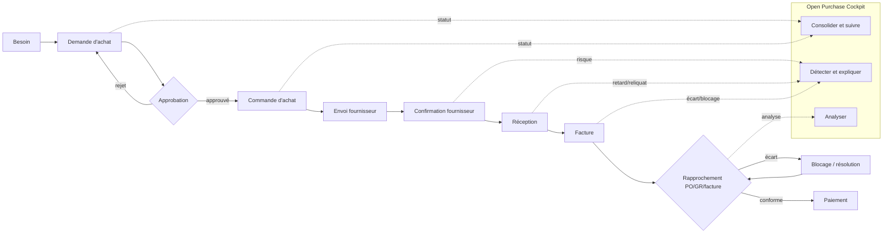

# Spécification produit et fonctionnelle

## 1. Executive Summary

Open Purchase Cockpit (OPC) est une application web open source de lecture, d'analyse et d'aide à l'action sur le processus Purchase-to-Pay (P2P) de SAP S/4HANA. Elle consolide demandes, commandes, réceptions, factures et fournisseurs sans étendre le cœur SAP. L'application privilégie les API publiées et CDS standard, applique un contrôle d'accès par rôle et périmètre organisationnel, et garde toute écriture SAP hors MVP.

La cible recommandée est un frontend OpenUI5/SAPUI5, un backend open source stateless, des adaptateurs SAP versionnés et PostgreSQL pour les projections analytiques. Le mode temps réel interroge SAP via API; les vues agrégées utilisent une synchronisation incrémentale. Redis reste optionnel. Le cockpit ne devient jamais le système d'enregistrement.

### Résultats attendus

- Une vue P2P cohérente, traçable jusqu'au document SAP source.
- Une réduction du temps d'identification des retards, reliquats et écarts 3-way match.
- Des alertes explicables et assignables.
- Un développement possible sans SAP grâce au Mock SAP Server et au dataset de référence.
- Un socle extensible sans modification du noyau grâce aux ports/adaptateurs et aux règles déclaratives.

### Hors périmètre initial

Création/modification de documents SAP, exécution du paiement, remplacement de SAP Workflow/Flexible Workflow, calcul comptable officiel, scoring fournisseur automatique à conséquence contractuelle, et prise de décision autonome par IA.

## 2. Vision et principes

**Proposition de valeur :** donner à chaque acteur achats une vue adaptée, de la demande à la facture, avec les exceptions prioritaires et leur explication.

Principes : API-first, read-only par défaut, Clean Core, least privilege, séparation domaine/connecteurs, fraîcheur visible, calculs reproductibles, accessibilité WCAG 2.2 AA, internationalisation et humain responsable de toute action métier.

### Indicateurs et définitions

| KPI | Définition canonique |
|---|---|
| Montant achats | Somme de la valeur nette des postes PO dans la devise de reporting, sur la période et le périmètre |
| Commandes ouvertes | PO non supprimées ayant au moins un poste avec quantité ou valeur restante > tolérance |
| En retard | date de livraison confirmée, sinon planifiée, < date métier et quantité reçue < commandée |
| Sans confirmation | poste soumis à confirmation et aucune confirmation exploitable reçue |
| OTIF | livraisons à l'heure et complètes / livraisons échues; tolérances configurables |
| Facture bloquée | facture avec indicateur de blocage SAP ou écart dépassant une tolérance active |
| Valeur restante | max(valeur commandée − valeur reçue/acceptée selon configuration, 0) |

Les conversions utilisent une table de taux datée et conservent montant/devise d'origine. Les annulations, retours, postes supprimés et services sont traités explicitement dans le dictionnaire de données à affiner pendant le fit-to-standard.

## 3. Personas et habilitations

| Rôle | Objectifs | Informations | Actions OPC | KPI | Droits |
|---|---|---|---|---|---|
| Acheteur | Prioriser relances et transformer besoins | PR/PO, confirmations, échéances, fournisseur | filtrer, exporter, assigner/acknowledger une alerte, ouvrir SAP | retards, sans confirmation, valeur ouverte | lecture sur groupes acheteurs autorisés; gestion de ses alertes |
| Responsable achats | Piloter équipe et performance | agrégats, charge, catégories, exceptions | répartir alertes, commenter, exporter | spend, OTIF, backlog, cycle PR→PO | lecture organisation; gestion alertes de l'équipe |
| Approvisionneur | Sécuriser disponibilité | échéanciers, réceptions, reliquats, confirmations | qualifier risque, relancer hors système, annoter | livraisons à 3/7 jours, reliquats | société/plant/groupe autorisés |
| Contrôleur de gestion | Contrôler dépenses et écarts | imputation, centre de coût, prix, facture | analyser, exporter données autorisées | variance prix/quantité, spend budget | lecture financière restreinte; données bancaires exclues |
| Responsable fournisseur | Améliorer performance fournisseur | OTIF, incidents, volumes, tendances prix | créer note/incidence interne, consulter score explicable | OTIF, incidents, variation prix | portefeuille fournisseurs assigné |
| Administrateur | Exploiter et gouverner | santé connecteurs, synchronisations, règles, audit | gérer config, règles, rôles, reprises | fraîcheur, erreurs sync, disponibilité | administration; pas d'accès métier implicite |
| Direction achats | Décider et suivre objectifs | agrégats consolidés et tendances | drill-down selon habilitation, exporter synthèse | spend, concentration, OTIF, économies | lecture agrégée multi-organisation; détail selon périmètre |

`Admin` est une capacité technique et ne contourne pas les périmètres métier. Les rôles se cumulent; l'intersection des politiques de données reste appliquée.

## 4. Processus Purchase-to-Pay



OPC observe toutes les étapes de PR à facture, calcule KPI et alertes, puis deep-link vers l'application Fiori/SAP autorisée. L'approbation, la réception, le rapprochement officiel et le paiement restent dans SAP.

## 5. Exigences fonctionnelles

### Dashboard

- `FR-DAS-001` Afficher montant achats, PO ouvertes/en retard/sans confirmation, livraisons attendues et factures bloquées avec période, devise de reporting et horodatage de fraîcheur.
- `FR-DAS-002` Afficher dépenses par fournisseur/catégorie et évolution mensuelle.
- `FR-DAS-003` Chaque tuile permet un drill-down conservant filtres et périmètre.
- `FR-DAS-004` Filtre global : période, société, organisation, groupe acheteur, devise.

### Purchase Requisitions

- `FR-PR-001` Recherche par numéro, texte, article, demandeur et fournisseur souhaité.
- `FR-PR-002` Filtres statut, société, organisation, groupe, date, imputation et « non transformée ».
- `FR-PR-003` Consultation entête/postes, statut d'approbation, quantité/valeur et PO liée.
- `FR-PR-004` Regroupement par demandeur, catégorie, organisation ou statut et export contrôlé.

### Purchase Orders

- `FR-PO-001` Lister numéro/poste, fournisseur, société, organisation, groupe, article, quantités, prix, devise, dates, reçu, restant, valeur restante et statut.
- `FR-PO-002` Rechercher, filtrer, trier, grouper, paginer côté serveur et enregistrer une variante personnelle.
- `FR-PO-003` Détail avec échéanciers, historique, réceptions, factures, alertes et deep-link SAP.
- `FR-PO-004` Statuts dérivés explicables : ouvert, partiel, livré, en retard, fermé, supprimé.

### Supplier Cockpit

- `FR-SUP-001` Fiche fournisseur, données organisationnelles non sensibles, volume, PO ouvertes/en retard, OTIF, incidents, prix et principaux articles.
- `FR-SUP-002` Tendances comparables sur période et tolérances visibles.
- `FR-SUP-003` Restreindre les données aux périmètres de l'utilisateur.

### Delivery Monitoring

- `FR-DEL-001` Détecter retard, réception partielle, absence de réception, échéance proche et risque.
- `FR-DEL-002` Utiliser confirmation fournisseur si fiable, sinon échéancier PO, en indiquant la source.
- `FR-DEL-003` Permettre assignation, acquittement, commentaire et snooze borné des alertes.

### Invoice Monitoring

- `FR-INV-001` Identifier blocage, écart prix/quantité, PO sans facture et facture sans réception.
- `FR-INV-002` Expliquer le 3-way match au poste et afficher tolérances/références.
- `FR-INV-003` Masquer les données fiscales ou bancaires non nécessaires.

### Spend Analytics

- `FR-SPD-001` Analyser fournisseur, article, catégorie, société, organisation, groupe, centre de coût et période.
- `FR-SPD-002` Afficher montant original et converti, taux/date/source de conversion.
- `FR-SPD-003` Export asynchrone, audité, limité au périmètre.

### Alertes et administration

- `FR-ALT-001` Créer/dédupliquer/résoudre automatiquement une alerte avec preuve et règle/version.
- `FR-ALT-002` Workflow `OPEN → ACKNOWLEDGED → IN_PROGRESS → RESOLVED` ou `DISMISSED`, avec journal.
- `FR-ADM-001` Afficher santé/fraîcheur des connecteurs et relancer une synchronisation échouée idempotente.
- `FR-ADM-002` Publier des versions de règles après validation et simulation.

## 6. Architecture d'information SAPUI5/OpenUI5

```text
Home Dashboard
├── Purchase Requisitions
├── Purchase Orders
├── Deliveries
├── Suppliers
├── Invoices
├── Spend Analytics
├── Alerts
├── AI Assistant (optionnel)
└── Administration (habilité)
```

| Écran | Cible / objectif | Contenu & filtres | Actions/navigation | Composants recommandés |
|---|---|---|---|---|
| Dashboard | tous, pilotage | KPI, tendances; filtres globaux | drill-down, variante | `sap.f.DynamicPage`, `sap.m.GenericTile`, `VizFrame` ou cartes UI Integration |
| PR | acheteur/manager | liste et statut; org/date/demandeur | détail, export, PO liée | `sap.ui.mdc.Table`, `FilterBar`, `ObjectStatus` |
| PO | acheteur/approvisionneur | colonnes FR-PO-001 | détail, SAP link, alerte | `FlexibleColumnLayout`, `mdc.Table`, `ObjectPageLayout` |
| Deliveries | approvisionneur | échéanciers, risque, reliquat | assigner/acquitter | table analytique, `ProgressIndicator`, `MessageStrip` |
| Supplier | buyer/vendor mgr | fiche, OTIF, spend, incidents | drill-down PO/articles | `ObjectPageLayout`, microcharts, `VizFrame` |
| Invoices | contrôle/acheteur | blocages et 3-way match | expliquer, SAP link | `ObjectPageLayout`, `ObjectStatus`, tableau postes |
| Spend | management/contrôle | dimensions, période, devise | drill, export async | `AnalyticalTable`/`mdc.Table`, `VizFrame` |
| Alerts | opérationnels | sévérité, type, owner, âge | ack, assign, snooze, resolve | `IconTabBar`, table, `Dialog`, `Timeline` |
| AI Assistant | habilités | réponse sourcée + filtres | poser question, ouvrir preuve | `sap.m.FeedListItem`, `MessageStrip`; pas d'action autonome |
| Admin | admin | connecteurs, jobs, règles | simuler/publier/rejouer | `DynamicPage`, table, formulaires |

UX : URL deep-linkable, état de filtres dans le routeur, variantes personnelles, états empty/error/loading, affichage de la fraîcheur, clavier complet, contrastes AA, textes FR/EN et timezone utilisateur. Les graphiques ont une alternative tabulaire.
