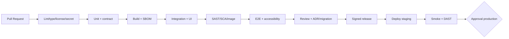

# Exigences non fonctionnelles, tests et SDLC

## 1. NFR mesurables

| ID | Domaine | Critère d'acceptation |
|---|---|---|
| NFR-PERF-001 | API | p95 ≤500 ms et p99 ≤1 s pour listes sur projection à 100 req/s, hors export/SAP live |
| NFR-PERF-002 | UI | LCP ≤2,5 s p75 sur poste standard/réseau entreprise; interaction filtre ≤1 s p95 |
| NFR-PERF-003 | volumes | 1 M postes PO, page 200 max, export 100 k lignes asynchrone sans OOM |
| NFR-AVL-001 | disponibilité | 99,5 % mensuel MVP hors maintenance planifiée; API dégradée explicite si SAP indisponible |
| NFR-DR-001 | reprise | RPO ≤24 h MVP, RTO ≤4 h; test restauration semestriel puis trimestriel en production critique |
| NFR-SCL-001 | scalabilité | API/worker horizontalement scalables; aucune session locale requise |
| NFR-SEC-001 | sécurité | 0 vulnérabilité Critical/High connue non acceptée à release; OWASP ASVS L2 cible |
| NFR-OBS-001 | observabilité | 100 % requêtes avec correlation ID; métriques RED, traces appels SAP, alertes SLO |
| NFR-AUD-001 | audit | 100 % exports, mutations, admin et IA audités; horloge UTC synchronisée |
| NFR-ACC-001 | accessibilité | WCAG 2.2 AA; 0 violation axe critique/sérieuse et parcours clavier validés |
| NFR-I18N-001 | i18n | FR/EN, aucun texte UI en dur, dates/nombres/devises localisés, fallback EN |
| NFR-RWD-001 | responsive | support ≥360 px; fonctions de consultation sur mobile, tables adaptées/colonnes prioritaires |
| NFR-QLT-001 | code | lint/typecheck zéro erreur; couverture domaine/règles ≥80 % lignes et 90 % branches critiques |
| NFR-FRESH-001 | fraîcheur | watermark visible; 95 % deltas PO ≤15 min cible configurable; alerte à 30 min |
| NFR-PRIV-001 | confidentialité | aucune donnée production en test; logs/secrets scans sans findings bloquants |

Les chiffres sont des objectifs initiaux à valider par volumétrie et SLA SAP pendant l'inception.

## 2. Pyramide de tests

- **Unitaires** : domaine, statuts, unités/devises, tolérances, règles, mappers; horloge injectée et tests property-based sur quantités/montants.
- **Contrat API** : validation OpenAPI, erreurs, curseurs, ETag, compatibilité consumer/provider.
- **Connecteurs SAP** : fixtures expurgées, pagination/delta, throttling, auth failure, champs absents, retours/annulations; contract suite commune Mock/SAP sandbox.
- **Base/intégration** : migrations réelles PostgreSQL, isolation transactionnelle, idempotence et reprise worker.
- **UI** : QUnit, tests composants, OPA5 pour navigation, axe accessibilité, snapshots seulement ciblés.
- **E2E** : Playwright contre stack Compose : login, dashboard→retard→PO, filtres, alerte, export, scope refusé.
- **Sécurité** : SAST, SCA, secret scan, SBOM, image/IaC scan, DAST, tests BOLA/IDOR et pentest avant production.
- **Performance** : k6/Gatling avec dataset représentatif, soak worker, SAP lent/429/503, objectifs NFR-PERF.
- **Résilience** : coupure SAP/DB, retry storm, poison message, restauration sauvegarde.

## 3. Mock SAP Server

Service `mock-sap/` futur, conteneurisé, expose les sous-ensembles OData/API retenus et lit `examples/demo-data.json`. Capacités : `$filter/$select/$expand/$top/$skiptoken` nécessaires, métadonnées, pagination déterministe, ETag, delta token, Basic/OAuth factice uniquement en local, profils de latence/429/401/500, évolution de scénario et horloge configurable. Il ne prétend pas reproduire SAP; il vérifie le contrat du port.

Scénarios obligatoires : happy path, PO retardée, partielle, multi-échéances, sans confirmation, GR annulé, retour, écart prix, écart quantité, facture bloquée, PR non transformée, devises/unités diverses, pagination et champ optionnel absent.

## 4. Pipeline et quality gates

Chaque PR lie US/exigence, décrit risque et preuve. Deux revues pour sécurité, règles, migrations ou connecteurs. Branch protection, commits/tags signés recommandés, build reproductible, provenance SLSA souhaitée. Environnements dev/test/staging/prod séparés, configuration externalisée, promotion du même artefact et rollback documenté.

## 5. Definition of Done d'une story

- Critères Gherkin automatisés au niveau approprié et revus.
- RBAC/périmètre, erreur, loading, empty, fraîcheur, i18n et accessibilité traités.
- OpenAPI/migration/ADR/docs mis à jour si concernés; télémétrie et audit ajoutés.
- Tests unitaires/contrat/intégration passent, scan sans blocant, revue approuvée.
- Déployée en staging, preuve jointe, feature flag et rollback lorsque risque notable.

## 6. Exploitation

SLI : disponibilité, latence/erreurs API, fraîcheur par source, taux succès sync, backlog worker, erreurs mapping, saturation DB, volumes alertes, export/IA. Alertes orientées symptômes avec runbooks. Dashboards séparent panne SAP, connecteur, projection et UI. Releases SemVer, changelog, migrations testées, sauvegarde avant migration risquée.
